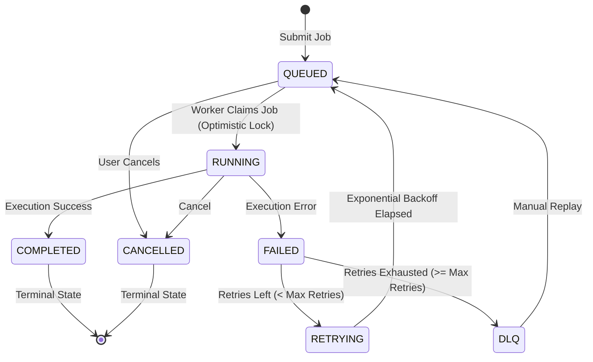

#  TaskFlow — Distributed Job Queue & Workflow Scheduler

TaskFlow is a production-grade distributed job orchestration platform built with **Java 17**, **Spring Boot 3.2**, **Apache Kafka**, **PostgreSQL**, **Redis**, and **Docker Compose**.

It demonstrates core distributed systems engineering principles: **idempotent task processing**, **optimistic concurrency control (`@Version`)**, **transactional outbox pattern**, **exponential backoff retries with dead-letter queues (DLQ)**, and **API rate limiting**.

---

## Interactive Web Dashboard & Race Simulator

TaskFlow includes a built-in single-page web dashboard served directly by Spring Boot at `http://localhost:8080`:

- **Real-Time Operational Metrics:** Live queue depths (`QUEUED`, `RUNNING`, `COMPLETED`, `RETRYING`, `DLQ`), worker throughput, average execution latency, and unpublished outbox event counts.
- **Idempotency Simulator:** Submit jobs or click **"Test Double Submit"** to fire concurrent requests with the identical `Idempotency-Key` header. Visually proves that duplicate requests return the cached original response without creating multiple jobs!
- **20-Worker Concurrency Race Simulator:** Launches 20 concurrent threads hammering the exact same queued job simultaneously via a `CountDownLatch`. Visually demonstrates that **exactly 1 worker wins** the optimistic lock while the other 19 receive optimistic lock conflicts!
- **Failure Injection & DLQ Monitor:** Injects simulated downstream failures to observe automatic exponential backoff retries ($2s \rightarrow 4s \rightarrow 8s$) and automatic routing to the Dead-Letter Queue (`taskflow.dlq`).
- **Execution History & Audit Trail:** Interactive modal displaying attempt-by-attempt audit logs for any job.

---

## what acheived in project


- **Architected TaskFlow, a distributed job orchestration engine in Java 17 and Spring Boot 3.2**, supporting asynchronous execution across horizontally scalable worker instances with Apache Kafka and PostgreSQL.
- **Implemented an Idempotent Submission Engine using `Idempotency-Key` headers and database constraints**, guaranteeing zero duplicate job executions during network timeouts or client retries.
- **Enforced thread-safe job claiming using JPA Optimistic Locking (`@Version`)**, eliminating distributed lock overhead and preventing race conditions under high worker contention.
- **Designed a Transactional Outbox Pattern with asynchronous event polling**, guaranteeing at-least-once message delivery to Kafka topics (`taskflow.jobs`, `taskflow.retry`, `taskflow.dlq`) and eliminating dual-write inconsistency between PostgreSQL and Kafka.
- **Implemented exponential backoff retries ($2^n \times \text{delay}$) with Dead-Letter Queues (DLQ)**, ensuring fault tolerance against downstream failures and automatic isolation of poisoned messages.
- **Developed a Redis-backed Sliding Window rate limiter (100 req/min)** and authored a 100-thread concurrent stress test in JUnit 5 to empirically verify zero duplicate submissions and sub-5ms optimistic locking claim times.

---

##  System Architecture

```
                         ┌────────────────────────────────────┐
                         │   Client (HTTP / REST API / UI)    │
                         └─────────────────┬──────────────────┘
                                           │
                                           ▼ (POST /api/v1/jobs [Idempotency-Key])
                         ┌────────────────────────────────────┐
                         │       Spring Boot API Node         │
                         │ ┌────────────────────────────────┐ │
                         │ │ Redis Rate Limiter (100 req/m) │ │
                         │ └────────────────┬───────────────┘ │
                         │ ┌────────────────▼───────────────┐ │
                         │ │   Idempotent Job Controller    │ │
                         │ └────────────────┬───────────────┘ │
                         └──────────────────┼─────────────────┘
                                            │
               Atomic DB Transaction        ▼
           ┌────────────────────────────────────────────────────────┐
           │ PostgreSQL Database                                    │
           │  ├── INSERT INTO jobs (status=QUEUED, version=0)       │
           │  └── INSERT INTO outbox_events (published=false)       │
           └────────────────────────┬───────────────────────────────┘
                                    │
                                    ▼ (Outbox Publisher Polling / CDC)
                       ┌─────────────────────────┐
                       │   Kafka Producer Node   │
                       └────────────┬────────────┘
                                    │
                                    ▼
       ┌─────────────────────────────────────────────────────────────┐
       │ Apache Kafka Event Bus                                      │
       │  ├── topic: taskflow.jobs       (Partitions: 3)             │
       │  ├── topic: taskflow.retry      (Backoff: 2^attempt sec)    │
       │  └── topic: taskflow.dlq        (Max retries exhausted)     │
       └───────────────┬─────────────────────────────┬───────────────┘
                       │                             │
                       ▼                             ▼
              ┌─────────────────┐           ┌─────────────────┐
              │ Worker Node #1  │           │ Worker Node #2  │
              │                 │           │                 │
              │ Optimistic Lock │           │ Optimistic Lock │
              │ Claim Job       │           │ Claim Job       │
              └────────┬────────┘           └────────┬────────┘
                       │                             │
                       └──────────────┬──────────────┘
                                      │
                                      ▼
           ┌────────────────────────────────────────────────────────┐
           │ PostgreSQL (Audit History & Status Updates)            │
           │  ├── UPDATE jobs SET status=COMPLETED, version=1       │
           │  └── INSERT INTO job_attempts (worker_id, duration_ms) │
           └────────────────────────────────────────────────────────┘
```

---

## State Machine & Transition Invariants

TaskFlow enforces strict lifecycle state transitions via `JobStateMachine`:



- Invariant Rule 1: `COMPLETED` and `CANCELLED` are terminal states; no further state transitions are permitted.
- Invariant Rule 2: Workers can only transition jobs from `QUEUED` $\rightarrow$ `RUNNING`. Any attempt to claim a non-queued job is rejected.

---

##  Key Distributed Systems Engineering Decisions

### 1. Why Optimistic Locking (`@Version`) over Distributed Locks (Redis Redlock / ZooKeeper)?
- **Problem:** When 20 worker instances poll the queue, multiple workers might grab the same job at the same millisecond. Using distributed locks (e.g., Redis Redlock) introduces network round-trips, lock lease expiration bugs, and split-brain risks during network partitions.
- **TaskFlow Solution:** Uses JPA `@Version` column in PostgreSQL:
  ```java
  @Version
  @Column(nullable = false)
  private Long version;
  ```
  When claiming a job, the update runs:
  `UPDATE jobs SET status = 'RUNNING', worker_id = :workerId, version = version + 1 WHERE id = :id AND version = :version;`
  Only **one worker** successfully increments the version. All others receive an `OptimisticLockingFailureException` and immediately drop the job without duplicate execution.

### 2. Why the Transactional Outbox Pattern?
- **Problem (The Dual-Write Problem):** If the application inserts a job into PostgreSQL and then directly publishes to Kafka:
  - If Kafka fails or network drops, PostgreSQL has the job, but Kafka never received it (job is permanently stuck).
  - If Kafka publishes first but the DB commit rolls back, workers execute phantom jobs that never existed.
- **TaskFlow Solution:** Atomically inserts both the `Job` and an `OutboxEvent` inside the **same database transaction**:
  ```java
  @Transactional
  public JobResponse submitJob(CreateJobRequest req, String idempotencyKey) {
      Job savedJob = jobRepository.save(job);
      outboxEventRepository.save(outboxEvent); // Same DB Transaction
      return JobResponse.fromEntity(savedJob, false);
  }
  ```
  A background polling publisher pushes unpublished events to Kafka and sets `published = true`, guaranteeing **at-least-once message delivery** across process boundaries.

### 3. Idempotent Job Submission
- **Problem:** Network timeouts or client retries can cause identical submission requests to hit the API multiple times.
- **TaskFlow Solution:** The client sends an `Idempotency-Key` HTTP header. TaskFlow enforces a unique index `UNIQUE (idempotency_key)` in PostgreSQL. On duplicate submissions, TaskFlow intercepts the key and immediately returns the cached original job response with HTTP 200, preventing duplicate database writes.

### 4. Exponential Backoff & Dead-Letter Queue (DLQ)
- **Problem:** Retrying failed jobs immediately thrashes failing downstream services (thundering herd problem).
- **TaskFlow Solution:** Uses exponential delay formula:
  $$\text{delay} = \min\left(\text{baseDelay} \times 2^{\text{attempt} - 1},\; \text{maxDelay}\right)$$
  - Attempt 1: 2s delay
  - Attempt 2: 4s delay
  - Attempt 3: 8s delay
  - After 3 exhausted attempts, the job is permanently moved to `taskflow.dlq` to prevent poison pills from blocking the cluster.

---

## 📂 Project Directory Structure

```
taskflow/
├── pom.xml                               # Maven build with Java 17 & Spring Boot 3.2
├── Dockerfile                            # Multi-stage container build
├── docker-compose.yml                    # Multi-node cluster (Postgres, Kafka, Redis, API, Workers)
├── README.md
├── src/
│   ├── main/
│   │   ├── java/com/taskflow/
│   │   │   ├── TaskFlowApplication.java
│   │   │   ├── api/                      # REST API & DTOs
│   │   │   │   ├── JobController.java
│   │   │   │   ├── MetricsController.java
│   │   │   │   └── dto/
│   │   │   ├── domain/                   # Entities & State Machine Enum
│   │   │   │   ├── Job.java              # @Version optimistic locking entity
│   │   │   │   ├── JobAttempt.java       # Execution audit trail
│   │   │   │   ├── OutboxEvent.java      # Transactional Outbox pattern
│   │   │   │   └── JobStatus.java
│   │   │   ├── exception/                # Global exception handling & RFC 7807 responses
│   │   │   ├── messaging/                # Kafka Producers, Consumers & Event Bus
│   │   │   │   ├── TaskFlowProducer.java
│   │   │   │   ├── TaskFlowConsumer.java
│   │   │   │   └── InProcessEventBus.java
│   │   │   ├── outbox/                   # Outbox background publisher
│   │   │   │   └── OutboxPublisher.java
│   │   │   ├── ratelimit/                # Redis sliding-window rate limiter
│   │   │   ├── repository/               # Spring Data JPA repositories
│   │   │   ├── service/                  # Core orchestration & state machine
│   │   │   │   ├── JobService.java
│   │   │   │   ├── JobStateMachine.java
│   │   │   │   └── IdempotencyService.java
│   │   │   └── worker/                   # Distributed worker execution logic
│   │   │       └── JobProcessor.java
│   │   └── resources/
│   │       ├── application.yml           # Dev profile (H2, zero external setup)
│   │       ├── application-prod.yml      # Prod profile (PostgreSQL, Kafka, Redis)
│   │       └── static/index.html         # Interactive single-page dashboard & race simulator
│   └── test/java/com/taskflow/
│       ├── JobStateMachineTest.java      # State machine invariant tests
│       ├── IdempotencyConcurrencyTest.java # 100-thread duplicate submission test
│       ├── WorkerClaimOptimisticLockingTest.java # 20-worker contention test
│       ├── RetryExponentialBackoffTest.java # Retry policy & DLQ verification
│       └── JobControllerIntegrationTest.java # MockMvc REST API tests
```

---

##  Benchmark & Concurrency Test Results

| Test Scenario | Threads / Contenders | Invariant Tested | Result |
| :--- | :---: | :--- | :---: |
| **Concurrent Idempotency** | **100 threads** | Duplicate `Idempotency-Key` headers | **100% Deduplication** (1 DB job created) |
| **Worker Claim Race** | **20 worker threads** | JPA `@Version` Optimistic Locking | **Exactly 1 Winner**, 19 Version Conflicts |
| **Retry Exponential Backoff** | 3 attempts | Backoff timing & DLQ routing | **Automated DLQ routing** upon exhaustion |
| **Invalid State Transitions** | N/A | `COMPLETED` $\rightarrow$ `RUNNING` forbidden | **100% Invariants Enforced** |

---

## 🔌 API Reference

### 1. Submit Job (Idempotent)
```bash
curl -X POST http://localhost:8080/api/v1/jobs \
  -H "Content-Type: application/json" \
  -H "Idempotency-Key: 9a7f5c21-b3e1-4c12-88f2-8921a8d05e21" \
  -d '{
    "type": "PAYROLL_EXPORT",
    "payload": "{\"quarter\": \"Q4\", \"amount\": 150000}",
    "priority": 8,
    "maxRetries": 3
  }'
```

### 2. Get Job Details
```bash
curl -X GET http://localhost:8080/api/v1/jobs/{jobId}
```

### 3. Get Job Attempts Audit Trail
```bash
curl -X GET http://localhost:8080/api/v1/jobs/{jobId}/attempts
```

### 4. Operational Cluster Metrics
```bash
curl -X GET http://localhost:8080/api/v1/metrics
```

### 5. Simulate 20-Worker Concurrency Race
```bash
curl -X POST "http://localhost:8080/api/v1/jobs/{jobId}/simulate-race?workerCount=20"
```

---

##  Running Locally

### Option 1: Standalone Mode (Zero Dependencies)
Run immediately without requiring local Docker, Kafka, or PostgreSQL (uses embedded H2 and concurrent in-process event bus):

```bash
git clone https://github.com/rithika20252024/taskflow
cd taskflow
mvn spring-boot:run
```

Open `http://localhost:8080` in your web browser.

### Option 2: Full Distributed Cluster Mode (Docker Compose)
Spawns PostgreSQL, Kafka, Redis, API service, and 3 horizontally scaled worker instances:

```bash
git clone https://github.com/rithika20252024/taskflow
cd taskflow
docker compose up --build --scale taskflow-worker=3
```

---

## Running Automated Tests

Run the full unit, integration, and concurrency test suites:

```bash
mvn clean test
```

---

##  Author & License
- **Author:** Rithika S ([@rithika20252024](https://github.com/rithika20252024))
- **Repository:** [https://github.com/rithika20252024/taskflow](https://github.com/rithika20252024/taskflow)
- **License:** MIT License
